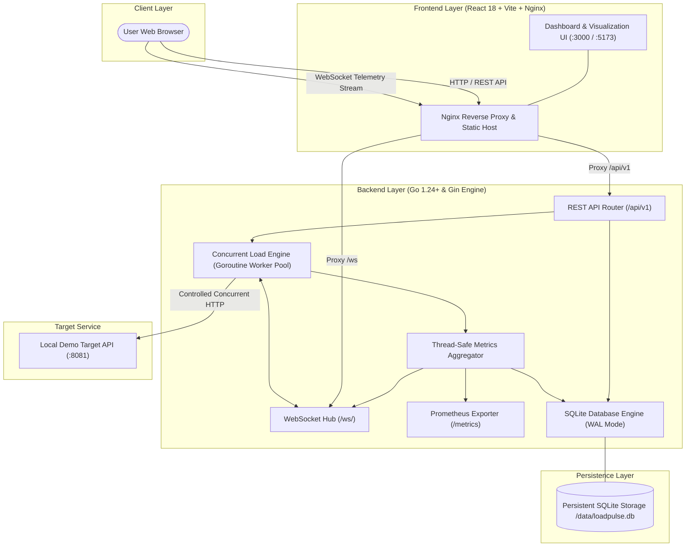

# Automated API Load Testing Platform

An enterprise-ready, developer-centric platform to benchmark, stress test, and monitor API performance with real-time WebSocket telemetry, Prometheus metrics export, SQLite persistence, test comparison matrix, and advanced analytics.

---

## 1. Project Overview

Modern web applications and microservices require rigorous load testing to identify throughput bottlenecks, tail-latency regressions (P95/P99), and concurrency-induced failure modes before deploying to production.

### Problem Statement
Traditional load-testing tools often present friction:
- Complex CLI-only workflows with disconnected analysis tools.
- Resource-heavy Java/JVM footprints.
- Lack of immediate, live real-time visual telemetry during active test execution.
- Difficult historical comparison between optimization runs.

### Solution
**Automated API Load Testing Platform** is a lightweight, full-stack load generation and benchmarking suite:
- **Go Engine**: Bounded concurrent goroutine worker pool executing controlled HTTP load with low memory overhead.
- **Live Telemetry Pipeline**: Real-time 500ms metric snapshots broadcast over WebSockets to interactive charts.
- **Prometheus Observability**: Scrape-ready `/metrics` endpoint exporting standard Prometheus metrics.
- **Persistent Test History**: SQLite storage capturing every test run with exact percentiles, HTTP status distributions, and error breakdowns.
- **Advanced Analytics & Comparison**: Side-by-side benchmark matrix comparing multiple test runs with differential delta badges.
- **Exportable Reports**: One-click downloads for JSON, GitHub-Flavored Markdown (GFM), and CSV reports, plus printable audit views.

---

## 2. Architecture



---

## 3. Technology Stack

| Domain | Technology / Library | Purpose |
| :--- | :--- | :--- |
| **Backend Language** | Go 1.24+ | High-performance, concurrent load generation and routing |
| **Web Framework** | Gin Web Framework (`github.com/gin-gonic/gin`) | Modular REST API routing, CORS, and logging |
| **Concurrency & Workers** | Goroutines, Channels, `sync.WaitGroup`, `sync/atomic` | Controlled concurrent virtual user simulation |
| **WebSocket** | Gorilla WebSocket (`github.com/gorilla/websocket`) | Full-duplex real-time metric broadcasting |
| **Metrics & Observability**| Prometheus Golang Client (`prometheus/client_golang`) | Scrape endpoint, histogram buckets, and live gauges |
| **Embedded Database** | SQLite via Pure-Go Driver (`modernc.org/sqlite`) | CGO-free, embedded transactional persistence in WAL mode |
| **Frontend Framework** | React 18 & Vite | Fast, responsive single-page application |
| **Visualization** | Recharts (`recharts`) | Real-time and historical response time, RPS, and VU charts |
| **Icons & Design** | Lucide React (`lucide-react`) & Modern Vanilla CSS | Glassmorphism dark mode, responsive layouts, accessible controls |
| **Web Server (Docker)** | Nginx Alpine | Production reverse proxy, WebSocket upgrade, and static hosting |

---

## 4. UI Dashboard & Screenshots

> *Placeholder: Dashboard screenshots can be viewed in the UI running on port 3000 (Docker) or port 5173 (Dev).*

The dashboard provides six dedicated views:
1. **Live Dashboard**: Interactive configuration panel, real-time KPI cards, progress bar, and streaming charts (Latency, RPS, Error Rate, Active VUs).
2. **Create Test**: Presets for instant safe testing against users, products, orders, and simulated error scenarios.
3. **Test History**: Searchable, filterable (Status, HTTP Method), and multi-column sortable table of all historical runs.
4. **Analytics**: Peak throughput, peak active VUs, P50/P90/P95/P99 latency vs SLA thresholds, latency spread, and multi-run historical trends.
5. **Compare Tests**: Multi-test selection, side-by-side benchmark matrix table, comparative grouped bar charts, and differential delta indicators.
6. **Reports**: Global summary statistics, recent test logs, and direct JSON / Markdown / CSV export downloads.

---

## 5. Project Structure

```
automated-api-load-testing/
├── docker-compose.yml          # Production multi-service orchestration
├── .env.example                # Environment variable configuration template
├── .dockerignore               # Docker ignore rules
├── .gitignore                  # Git exclusions (no secrets, binaries, or node_modules)
├── README.md                   # Comprehensive project documentation
│
├── backend/                    # Go Backend Service
│   ├── cmd/
│   │   ├── server/main.go      # Primary backend daemon (:8080)
│   │   └── verify/main.go      # Automated CLI verification utility
│   ├── internal/
│   │   ├── config/             # Config loader (.env and environment defaults)
│   │   ├── database/           # SQLite migrations, connection pool, and queries
│   │   ├── engine/             # Load generator, worker pool, validator, percentiles
│   │   ├── handlers/           # HTTP handlers: tests, status, metrics, history, compare, export
│   │   ├── metrics/            # Prometheus registry, histograms, and live gauges
│   │   └── websocket/          # WebSocket hub, connection manager, client pump
│   ├── Dockerfile              # Multi-stage production container for Go backend
│   ├── .dockerignore           # Backend docker context rules
│   └── go.mod / go.sum
│
├── frontend/                   # React + Vite Single-Page Application
│   ├── src/
│   │   ├── components/         # ConfigPanel, MetricCards, ProgressBar, ErrorBoundary, Modal
│   │   ├── pages/              # Dashboard, HistoryView, AnalyticsView, ComparisonView, ReportsView
│   │   ├── charts/             # LatencyChart, ThroughputChart, ErrorRateChart, ActiveUsersChart
│   │   ├── hooks/              # useWebSocket live telemetry hook
│   │   ├── services/           # api.js client layer with export and compare helpers
│   │   └── styles/             # Modular CSS design system (dashboard, components, charts, print)
│   ├── nginx.conf              # Production Nginx reverse proxy with WebSocket upgrade
│   ├── Dockerfile              # Multi-stage Node builder + Nginx Alpine runtime
│   ├── .dockerignore           # Frontend docker context rules
│   └── package.json
│
└── demo-api/                   # Safe Companion Mock API Target
    ├── main.go                 # Mock endpoints (/users, /products, /orders) with delay/error simulation
    ├── main_test.go            # Demo API unit tests
    ├── Dockerfile              # Multi-stage container for Demo API (:8081)
    ├── .dockerignore
    └── go.mod
```

---

## 6. How It Works

1. **Configuring a Test**:
   The user specifies the target endpoint, HTTP method (`GET`, `POST`, `PUT`, `DELETE`), headers, query parameters, payload, virtual users (1–500), and test duration or total request limit.
2. **Safety Validation**:
   The backend validator checks concurrency limits, timeout boundaries (50ms–30s), duration bounds (max 10 minutes), and ensures target URLs are valid HTTP/HTTPS schemes.
3. **Controlled Concurrency**:
   The Go engine initializes a worker pool. When a ramp-up duration is specified, virtual users spawn according to an incremental schedule. Each virtual user runs in an independent goroutine reusing an optimized HTTP client connection pool.
4. **Telemetry & Real-Time Calculation**:
   Every request records start time, end time, duration, status code, and success/failure. A lock-minimized metrics collector accumulates samples and computes instant throughput (RPS), running average latency, and exact percentiles (P50, P90, P95, P99).
5. **Broadcasting & Scraping**:
   Every 500ms, the WebSocket Hub pushes telemetry snapshots to all subscribed clients. In parallel, Prometheus live gauges (`loadtest_current_rps`, `loadtest_active_users`) and duration histograms update continuously.
6. **Persistence & Export**:
   Upon test completion, the entire run summary is committed to SQLite. Users can immediately review historical runs, compare multiple benchmarks, or export audit reports in JSON, Markdown, or CSV.

---

## 7. Local Setup (Without Docker)

### Prerequisites
- **Go**: 1.22 or newer (`go version`)
- **Node.js**: 20 or newer (`node -v`, `npm -v`)

### 1. Start the Demo Mock API (Target)
Open Terminal 1:
```bash
cd demo-api
go run main.go
# Listens on http://localhost:8081
```

### 2. Start the Go Backend Server
Open Terminal 2:
```bash
cd backend
go run ./cmd/server/main.go
# Listens on http://localhost:8080
```

### 3. Start the React Frontend Dashboard
Open Terminal 3:
```bash
cd frontend
npm install
npm run dev
# Vite dev server opens at http://localhost:5173
```

Navigate to `http://localhost:5173` in your browser.

---

## 8. Docker Setup & Deployment

The platform includes production-ready multi-stage Dockerfiles and a `docker-compose.yml` stack.

### Quick Start
```bash
# Build and start all services in detached mode
docker compose up --build -d
```

### Services, Port Mappings & Health Checks
| Service | Container Name | Host Port | Internal Port | Health Check |
| :--- | :--- | :--- | :--- | :--- |
| **Frontend** | `loadpulse-frontend` | `3000` | `80` (Nginx) | `curl -f http://localhost:80/` |
| **Go Backend** | `loadpulse-backend` | `8080` | `8080` | `curl -f http://localhost:8080/health` |
| **Demo Target API**| `loadpulse-demo-api` | `8081` | `8081` | `curl -f http://localhost:8081/health` |

### Verifying Persistent Storage
SQLite data is mapped to a named Docker volume (`loadpulse-data` mounted at `/data`):
```bash
# 1. Run a load test from the UI or API
# 2. Stop the containers
docker compose down

# 3. Start the stack again
docker compose up -d

# 4. Open http://localhost:3000/ - all historical test results are preserved!
```

---

## 9. API Documentation

All routes use the actual backend paths implemented in `backend/cmd/server/main.go`:

### Core Endpoints
| Method | Path | Description |
| :--- | :--- | :--- |
| `GET` | `/health` or `/api/v1/health` | System and database connectivity check |
| `GET` | `/metrics` or `/api/v1/metrics`| Prometheus metrics scrape endpoint |

### Load Testing Lifecycle
| Method | Path | Description |
| :--- | :--- | :--- |
| `POST` | `/api/v1/tests` | Validate and initiate a new concurrent load test |
| `GET` | `/api/v1/tests/status` | Current engine execution status (`idle`, `running`, `completed`, `stopped`) |
| `GET` | `/api/v1/tests/metrics` | Latest live or final test metrics snapshot |
| `POST` | `/api/v1/tests/stop` | Gracefully cancel and stop an active load test |

#### Sample Start Test Request (`POST /api/v1/tests`):
```json
{
  "target_url": "http://localhost:8081/api/products?delay_ms=20",
  "method": "GET",
  "virtual_users": 5,
  "duration_seconds": 10,
  "timeout_seconds": 5
}
```

### Test History & Benchmark Analytics
| Method | Path | Description |
| :--- | :--- | :--- |
| `GET` | `/api/v1/tests` | Query historical test runs (supports `search`, `method`, `status`, `sort_by`, `order`, `page`, `page_size`) |
| `GET` | `/api/v1/tests/:id` | Fetch complete details and percentile breakdown for a specific test |
| `GET` | `/api/v1/tests/summary` | Global aggregate statistics (total tests, total requests, overall error rate) |
| `GET` | `/api/v1/tests/compare?ids=id1,id2` | Side-by-side comparison and delta calculations between 2+ test runs |
| `DELETE`| `/api/v1/tests/:id` | Permanently delete a single test run record |
| `DELETE`| `/api/v1/tests` | Clear the entire historical test database |

### Report Exports
| Method | Path | Description |
| :--- | :--- | :--- |
| `GET` | `/api/v1/tests/:id/export?format=json` | Download structured JSON performance report |
| `GET` | `/api/v1/tests/:id/export?format=markdown` | Download formatted GitHub-Flavored Markdown report |
| `GET` | `/api/v1/tests/:id/export?format=csv` | Download CSV metrics export |

---

## 10. WebSocket Telemetry

Connect to stream real-time metrics pushed every 500ms during active load generation:

- **General Hub**: `ws://localhost:8080/ws/metrics`
- **Specific Test Stream**: `ws://localhost:8080/ws/tests/{testId}`

### Real-Time Metric Payload Frame:
```json
{
  "test_id": "e711bce9-6da2-41bd-955e-a1b977393e77",
  "status": "running",
  "timestamp": "2026-09-27T10:56:04Z",
  "total_requests": 142,
  "successful_requests": 142,
  "failed_requests": 0,
  "error_rate": 0.0,
  "requests_per_second": 52.3,
  "average_latency_ms": 54.8,
  "p50_latency_ms": 54.8,
  "p95_latency_ms": 66.3,
  "p99_latency_ms": 146.2,
  "active_users": 3
}
```

---

## 11. Prometheus Metrics

The backend exposes a standard Prometheus exporter at `http://localhost:8080/metrics`.

### Key Metrics Exported:
| Metric Name | Type | Description |
| :--- | :--- | :--- |
| `loadtest_requests_total` | Counter | Total requests partitioned by `method`, `status_code`, and `success` |
| `loadtest_request_duration_seconds` | Histogram | Request latency histogram with configurable percentile buckets |
| `loadtest_active_users` | Gauge | Number of concurrently active virtual users |
| `loadtest_current_rps` | Gauge | Instant throughput (requests per second) |
| `loadtest_running_tests` | Gauge | Number of currently executing test suites (0 or 1) |

---

## 12. Testing & Quality Assurance

### Run Backend Unit & Concurrency Tests:
```bash
cd backend
go vet ./...
go test -count=1 -v ./...
```

### Run Demo Mock API Tests:
```bash
cd demo-api
go test -count=1 -v ./...
```

### Run Frontend Tests & Production Build:
```bash
cd frontend
npm test
npm run build
```

---

## 13. Deployment Options & Honest Limitations

### Production Deployment Strategies:
1. **Single-Host VPS / VM (Docker Compose)**:
   Deploy `docker-compose.yml` to an AWS EC2, DigitalOcean Droplet, Linode, or Hetzner server behind Nginx or Traefik with automated Let's Encrypt SSL/TLS.
2. **Cloud Container Orchestration (AWS ECS / Google Cloud Run)**:
   Deploy the backend and frontend as distinct container services. For multi-container cloud deployments, map persistent storage via AWS EFS or migrate the persistence layer to PostgreSQL.
3. **Bare-Metal Linux Systemd**:
   Compile static Go binaries (`go build -ldflags="-w -s"`) and run as Systemd daemons reverse-proxied by host Nginx.

### Deployment Environment Limitations:
- **Local Host Docker CLI**: On Windows hosts without Docker Desktop installed, running local `docker compose` commands directly in PowerShell requires installing Docker Desktop for Windows with the WSL2 backend. The project includes verified, standards-compliant Dockerfiles and Compose configurations ready for immediate deployment on any machine with Docker installed.
- **Race Detector on Windows**: Running `go test -race` on Windows without MinGW/GCC outputs `go: -race requires cgo; enable cgo by setting CGO_ENABLED=1`. Concurrency safety is thoroughly verified via lock-free atomics, mutex locks, and high-concurrency stress test suites (`TestMetricsCollector_ConcurrentSafety`, `TestWebSocket_ConcurrentBroadcast`).

---

## 14. Security & Responsible Testing Safeguards

This software is designed exclusively for authorized benchmark, stress, and performance testing:
- **Strict Concurrency Limits**: Capped at 500 Virtual Users to safeguard local and staging infrastructure.
- **Duration Boundaries**: Test execution duration is strictly capped at 600 seconds (10 minutes).
- **Scheme Validation**: Rejects non-HTTP schemes (no `file://`, `ftp://`, or internal socket protocols).
- **Ethical Testing Policy**: Does **not** include mechanisms for DDoS attacks, credential stuffing, rate-limit evasion, WAF bypassing, or unauthorized access.

---

## 15. Future Enhancements

- Distributed multi-node load generators for cluster-scale benchmarking (10,000+ VUs).
- Support for gRPC and GraphQL target protocols.
- Automated threshold assertions / CI/CD quality gates (e.g. fail build if P95 exceeds 250ms).
- OAuth2 / JWT authorization flow simulation with token rotation.
- Webhook notifications (Slack, Discord, PagerDuty) on SLA threshold violations.
